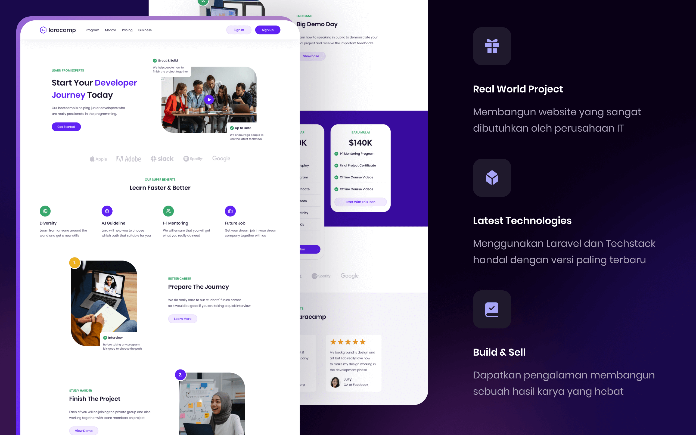

<p align="center">
    <a href="https://laravel.com" target="_blank">
    
    </a>
</p>

<p align="center">
    <a href="https://packagist.org/packages/laravel/framework"></a>
    <a href="https://packagist.org/packages/laravel/framework"></a>
    <a href="https://packagist.org/packages/laravel/framework"></a>
</p>

## About This Project

Laravel adalah framework untuk menciptakan aplikasi website moderen yang cepat dan berskala besar. Memiliki banyak keunggulan seperti dokumentasi produk yang rapi, Laravel juga kian populer di kalangan para freelancer karena kemudahannya dalam pengembangan project. Dengan Laravel, kodingan menjadi lebih terstruktur sehingga baris kode tidak perlu berulang-ulang. Laravel sangat tepat digunakan untuk web development dan berpotensi bagus untuk masa depan developer karena komunitasnya yang terus berkembang.

Melalui project “laracamp”, sebuah aplikasi bootcamp untuk developer, Mentor Taufan Fadhilah akan menjelaskan proses pengembangan secara tersusun dari persiapan sampai coding. Tahapan awal dimulai dari mengatur task di Notion agar baik developer dan klien bisa bersama-sama memantau kemajuan project. Setelah menyelesaikan slicing front-end, integrasi pada sisi back-end dilakukan yang mana prosesnya meliputi pemasangan OAuth Login supaya user bisa mengakses aplikasi melalui akun pribadi pilihan mereka. Kelas ini menggunakan tools PHP 7.4, MySQL 5.6 dan Ngrok stable.

## Getting Started

Follow these steps to set up and run the project locally:

1. Clone the repository:
     ```bash
     git clone https://github.com/imbasri/laracamp
     cd laracamp
     ```

2. Install dependencies:
     ```bash
     composer install
     npm install
     ```

3. Set up the environment:
     ```bash
     cp .env.example .env
     php artisan key:generate
     ```

4. Run the development server:
     ```bash
     php artisan serve
     ```

5. Access the application at `http://localhost:8000`.

## Screenshot



## Features

Laravel is a web application framework with expressive, elegant syntax. We believe development must be an enjoyable and creative experience to be truly fulfilling. Laravel takes the pain out of development by easing common tasks used in many web projects, such as:

- [Simple, fast routing engine](https://laravel.com/docs/routing).
- [Powerful dependency injection container](https://laravel.com/docs/container).
- Multiple back-ends for [session](https://laravel.com/docs/session) and [cache](https://laravel.com/docs/cache) storage.
- Expressive, intuitive [database ORM](https://laravel.com/docs/eloquent).
- Database agnostic [schema migrations](https://laravel.com/docs/migrations).

## Acknowledgments

Special thanks to 

[BuildWithAngga](https://buildwithangga.com) for sharing their knowledge and resources.

## License

This project is open-sourced software licensed under the [MIT license](https://opensource.org/licenses/MIT).

Laravel has the most extensive and thorough [documentation](https://laravel.com/docs) and video tutorial library of all modern web application frameworks, making it a breeze to get started with the framework.

If you don't feel like reading, [Laracasts](https://laracasts.com) can help. Laracasts contains over 1500 video tutorials on a range of topics including Laravel, modern PHP, unit testing, and JavaScript. Boost your skills by digging into our comprehensive video library.

## Laravel Sponsors

We would like to extend our thanks to the following sponsors for funding Laravel development. If you are interested in becoming a sponsor, please visit the Laravel [Patreon page](https://patreon.com/taylorotwell).

## Contributing

Thank you for considering contributing to the Laravel framework! The contribution guide can be found in the [Laravel documentation](https://laravel.com/docs/contributions).

## Code of Conduct

In order to ensure that the Laravel community is welcoming to all, please review and abide by the [Code of Conduct](https://laravel.com/docs/contributions#code-of-conduct).

## Security Vulnerabilities

If you discover a security vulnerability within Laravel, please send an e-mail to Taylor Otwell via [taylor@laravel.com](mailto:taylor@laravel.com). All security vulnerabilities will be promptly addressed.

## License

The Laravel framework is open-sourced software licensed under the [MIT license](https://opensource.org/licenses/MIT).
